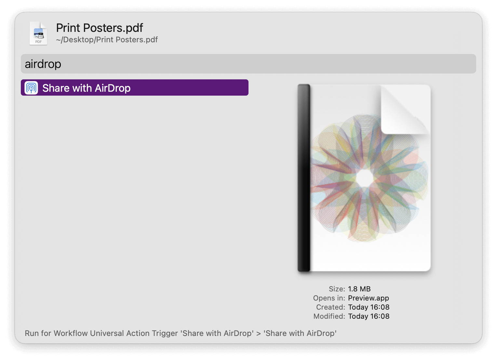
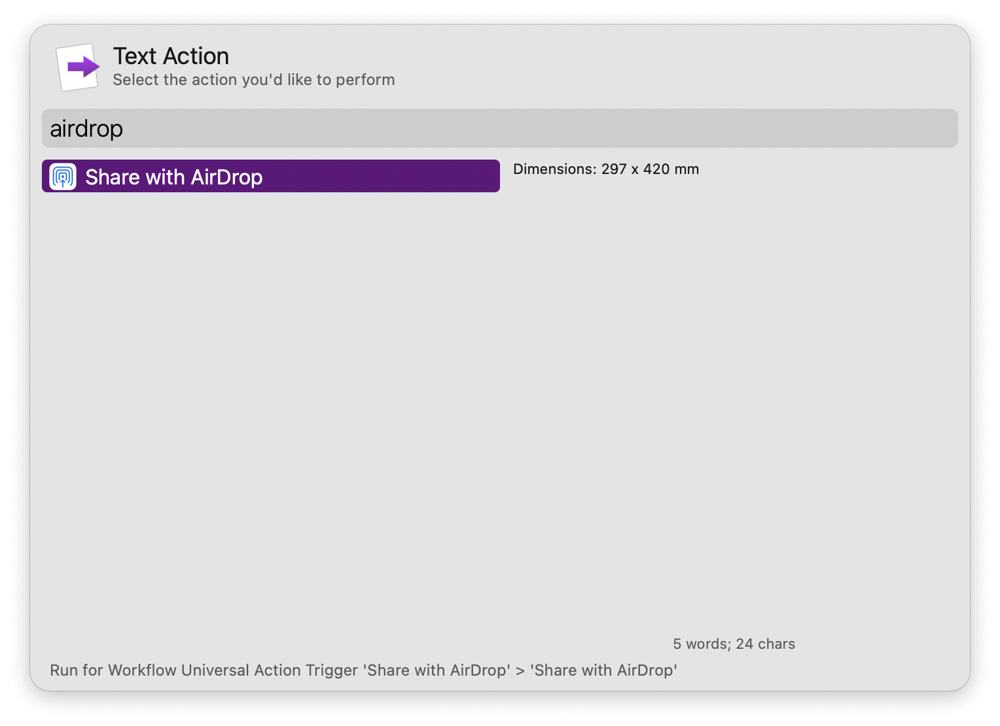
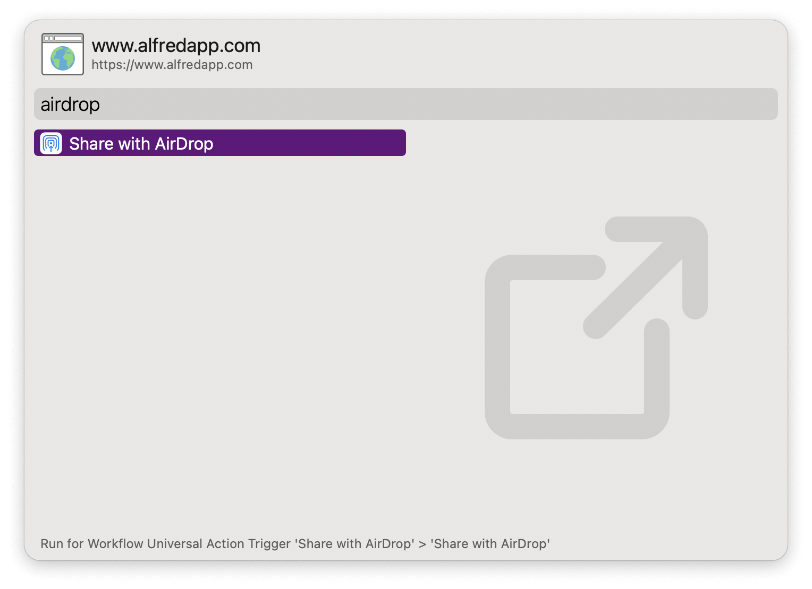

#  Share with AirDrop Alfred Workflow

Share files, text, and URLs via AirDrop

[⤓ Install on the Alfred Gallery](https://alfred.app/workflows/alfredapp/share-with-airdrop)

## Usage

Send files, text, and URLs with AirDrop via the [Universal Action](https://www.alfredapp.com/help/features/universal-actions/).

